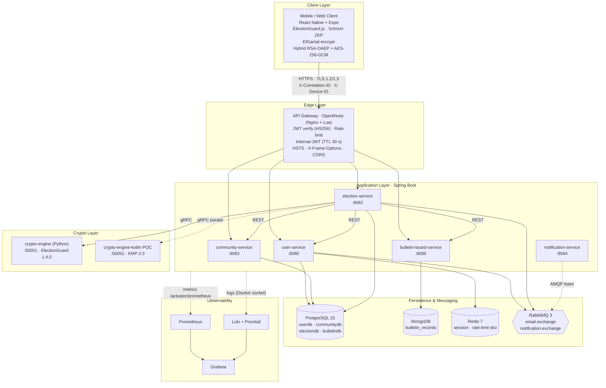
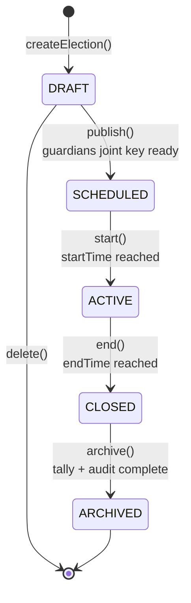
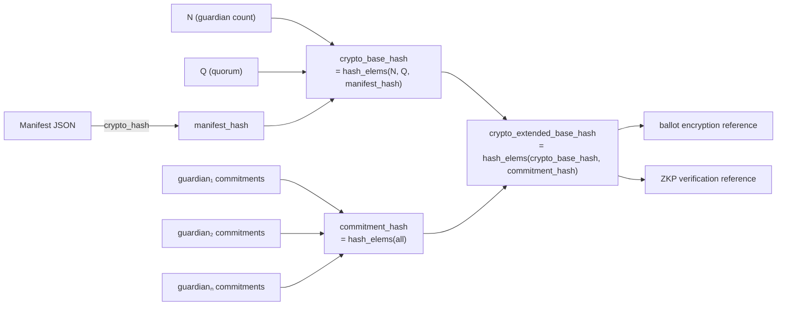
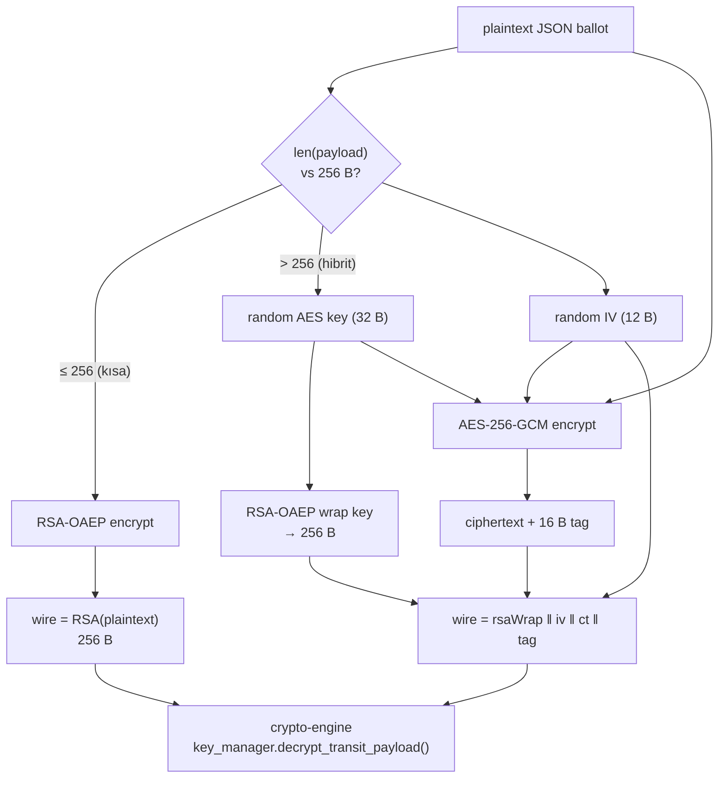
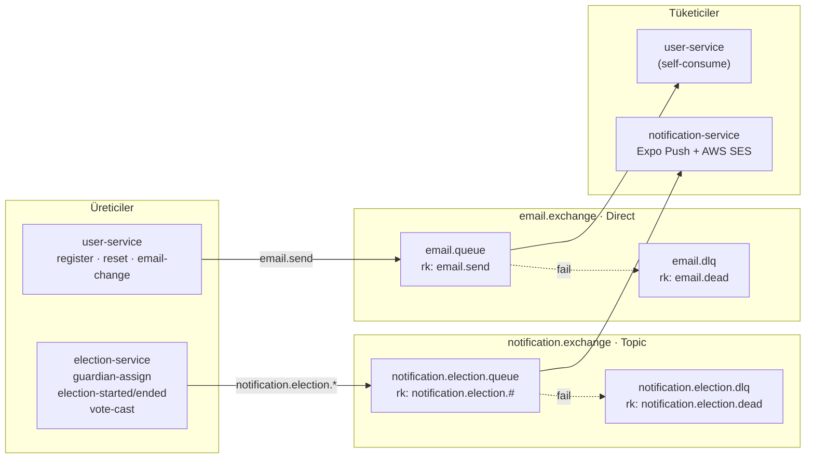
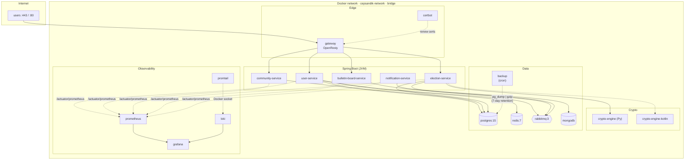
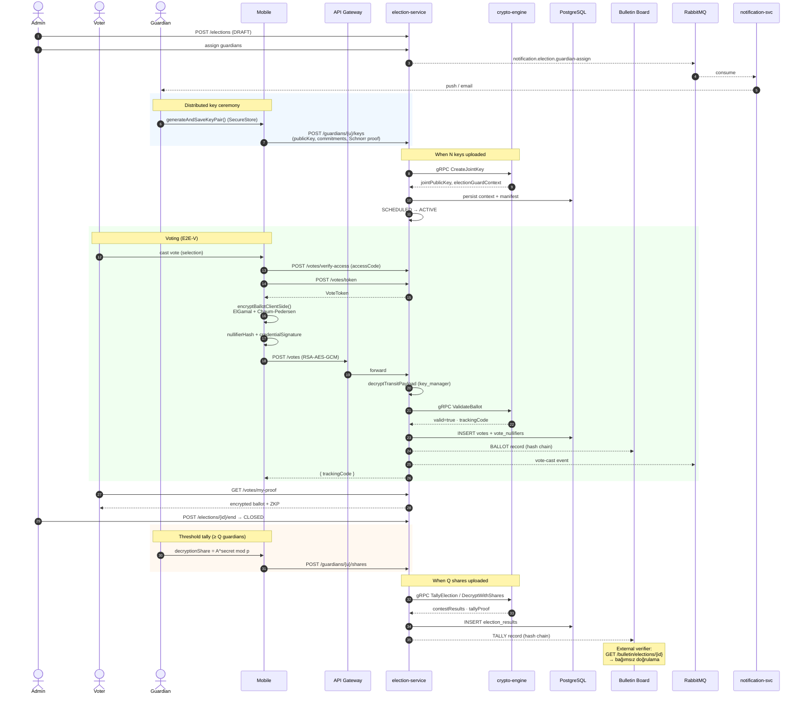

# CepSandık — JISA System Architecture Reference

> Bu dosya, **JISA (Journal of Information Security and Applications)** makalesinin "System Architecture" bölümünü yazarken referans olarak kullanılmak üzere hazırlanmıştır. Tüm sayılar, sürümler, port'lar, RPC isimleri, DB tabloları ve config değerleri kaynak kodun mevcut hâlinden (2026-05-11) çıkarılmıştır.
>
> Bölümler bağımsız okunabilir; makale yazılırken doğrudan blok-blok alınabilir.

---

## 0. Tek Cümlede Sistem

CepSandık, ElectionGuard tabanlı **uçtan uca doğrulanabilir (End-to-End Verifiable, E2E-V)** mobil oylama platformudur. Mimari **mikroservis (Spring Boot, Java 17/21) + kriptografi motoru (Python/gRPC + Kotlin/KMP POC) + asenkron denetim (RabbitMQ → MongoDB Bulletin Board) + OpenResty/Lua API Gateway** katmanlarından oluşur. İstemci tarafı **React Native / Expo** olup, oy şifreleme istemcide gerçekleştirilir; sunucu hiçbir zaman düz metin oyu görmez.

---

## 1. Yüksek Seviyeli Mimari Görünümü

### 1.1 Katmanlar

| Katman | Bileşen | Sorumluluk |
|---|---|---|
| **Client** | React Native / Expo mobil uygulama | Oy şifreleme (ElGamal + Chaum-Pedersen ZKP), Schnorr proof, RSA-AES-GCM transit |
| **Edge** | OpenResty (Nginx + Lua) Gateway | TLS 1.2/1.3 termination, JWT verify, rate limit, X-Correlation-ID, internal-JWT issuance |
| **Application** | 5 Spring Boot mikroservisi | İş mantığı (User, Community, Election, Bulletin Board, Notification) |
| **Crypto** | Python `crypto-engine` (gRPC) + Kotlin `crypto-engine-kotlin` (POC) | ElectionGuard işlemleri (setup, validate ballot, tally, threshold decrypt) |
| **Persistence** | PostgreSQL 15 (4 ayrı DB), MongoDB (Bulletin Board), Redis 7, RabbitMQ 3 | İlişkisel veri, append-only ledger, cache/session, mesaj kuyruğu |
| **Observability** | Prometheus + Loki + Promtail + Grafana | Metrik, log, dashboard |

### 1.2 Sistem Diyagramı



---

## 2. Mikroservisler

Tüm Spring Boot servisleri Java 17/21, JPA/Hibernate, Spring Security ve Actuator (`/actuator/health`, `/actuator/prometheus`) kullanır. Stateless, horizontal-scalable.

### 2.1 user-service (port 8080)

| Özellik | Değer |
|---|---|
| Stack | Spring Boot 3.5.5, Java 21, jjwt 0.12.5, Bucket4j, Thymeleaf |
| DB | PostgreSQL — `userdb` |
| Bağımlılıklar | Redis (token/session cache), RabbitMQ (`email.exchange`), AWS S3 (avatar), AWS SES (mail), TOTP (2FA) |
| Sorumluluk | Auth, kullanıcı profili, 2FA/TOTP, parola sıfırlama, e-posta değişikliği, audit log, push token |

**Domain (özet):** `User` (UUID, email unique, `platformRole ∈ {USER, ADMIN, MODERATOR}`, `isGuardianEligible`, `pushToken`), `RefreshToken`, `PasswordResetToken`, `EmailChangeToken`, `TwoFactorAuth (totp_secret)`, `NotificationPreference`, `AuditLog`.

**Önemli endpoint'ler:** `/api/v1/auth/{register,login,login/2fa,refresh,logout,forgot-password,reset-password,activate}`, `/api/v1/users/{id}` CRUD.

**RabbitMQ:** `email.exchange` (Direct) → `email.queue` (`email.send`), DLQ `email.dlq`.

### 2.2 community-service (port 8083)

| Özellik | Değer |
|---|---|
| Stack | Spring Boot 3.5.5, Java 21 |
| DB | PostgreSQL — `communitydb` |
| Sorumluluk | Topluluk CRUD, üyelik (OWNER/MODERATOR/MEMBER), davet kodu, istatistik |

Domain: `Community (visibility ∈ {PUBLIC, PRIVATE}, soft-delete)`, `CommunityMember (status ∈ {PENDING, APPROVED, REJECTED})`, `CommunityInvitation (invitationCode, expiresAt)`. Internal endpoint'ler `InternalCommunityController` üzerinden, gateway-issued internal JWT ile korunur ve election-service tarafından üyelik doğrulamada kullanılır.

### 2.3 election-service (port 8082) — sistemin kalbi

| Özellik | Değer |
|---|---|
| Stack | Spring Boot 3.4.3, Java 21, gRPC 1.62.2, Protobuf 3.25.3 |
| DB | PostgreSQL — `electiondb` (Flyway V1–V11) |
| Bağımlılıklar | crypto-engine (gRPC), community-service (REST), user-service (REST), bulletin-board (REST), RabbitMQ (`notification.exchange`) |

**Domain:**

* `Election` — `status ∈ {DRAFT → SCHEDULED → ACTIVE → CLOSED → ARCHIVED}`, `type ∈ {SINGLE_CHOICE, MULTIPLE}`, `participantType ∈ {ALL_MEMBERS, SELECTED}`, `startTime/endTime` (timestamptz), `electionGuardContext` JSON (CiphertextElectionContext), `electionManifest` JSON (InternalManifest), `electionPublicKey` (joint ElGamal key), `guardianRecords` JSON, `minGuardiansThreshold` (Q), `tallyProof` JSON, `tallyResults` JSON.
* `Vote` — `ballotId` (anonim UUID), `encryptedBallot` (CiphertextBallot JSON), `trackingCode` (sunucu-otoriter), `zkpProof`, `ballotHash` (SHA-256), `castAt`. **Düz-metin aday alanı V11'de kaldırıldı.**
* `ElectionGuardian` — `userId`, `publicKey` (ElementModP hex), `commitments` (JSON ElementModP[]), `coefficientProofs` (Schnorr ZKP JSON), `keyBackups` (RSA-OAEP encrypted shares), `decryptionShare`, `status ∈ {PENDING, KEY_UPLOADED, SHARE_UPLOADED}`.
* `Candidate` — sadece sergi (display) bilgisi; oyun düz metni asla burada yer almaz.
* `AccessCode` — 6-haneli alfanümerik, kullanım sayacı, expiresAt.
* `VoteToken` — kullanıcı uygunluk delili (eligibility credential).
* `VoteNullifier` — anonim çift-oy önleyici.
* `ElectionResult` — `selectionId`, `tallyCount`, `tallyProof`.

**Election state machine:**



**REST (alıntı):**

```
POST  /api/v1/elections                                  Create draft
POST  /api/v1/elections/{id}/publish | start | end       State machine
POST  /api/v1/elections/{id}/candidates                  Add candidate
POST  /api/v1/elections/{id}/guardians/assign            Assign guardians
POST  /api/v1/elections/{id}/guardians/{u}/keys          Upload public key + Schnorr proof
POST  /api/v1/elections/{id}/guardians/{u}/shares        Upload decryption share
POST  /api/v1/elections/{eid}/votes/verify-access        Access code check
POST  /api/v1/elections/{eid}/votes/token                Issue VoteToken (eligibility)
POST  /api/v1/elections/{eid}/votes                      Submit ciphertext ballot
GET   /api/v1/elections/{eid}/votes/my-status            Voter status
GET   /api/v1/elections/{eid}/votes/bulletin/ballots/{trackingCode}
GET   /api/v1/elections/{id}/results                     Public/private results
```

**Konfig:**

```properties
app.guardian.count=3
app.guardian.quorum=2
app.guardian.dev-bypass=false
app.crypto-engine.host=crypto-engine
app.crypto-engine.port=50051
```

### 2.4 bulletin-board-service (port 8085)

| Özellik | Değer |
|---|---|
| Stack | Spring Boot 3.5.5, Java 21 |
| DB | MongoDB (append-only, `bulletin_records` koleksiyonu; hash-chain doğrulama için tercih edildi) — `@Document`, `MongoRepository` ile uygulanır |
| Sorumluluk | Şeffaf, tamper-evident "ilan panosu"; her oy ve tally için hash-chained record |

Hash zinciri:

```
recordHash = SHA-256(electionId | recordType | trackingCode | ballotHash | previousHash | payload)
```

`recordType ∈ {BALLOT, TALLY, METADATA}`. Bağımsız doğrulayıcı (verifier), zinciri uçtan uca tarayarak değişiklik tespiti yapabilir.

### 2.5 notification-service (port 8084)

| Özellik | Değer |
|---|---|
| Stack | Spring Boot 3.2.1, Java 21 |
| DB | Yok (stateless listener) |
| Bağımlılıklar | RabbitMQ (`notification.exchange` topic), Expo Push API, AWS SES / SMTP, Thymeleaf |

`notification.election.queue` (binding key `notification.election.#`) ile guardian assignment, oy başlangıç/bitiş bildirimi gibi olayları tüketir; kullanıcı `NotificationPreference`'ına göre PUSH / EMAIL kanalı seçer. DLQ: `notification.election.dlq`.

---

## 3. Kriptografi Motoru

### 3.1 crypto-engine (Python 3.10, gRPC :50051) — Production

**Kütüphaneler (`requirements.txt`):**
```
electionguard @ git+https://github.com/Election-Tech-Initiative/electionguard-python.git@1.4.0
grpcio==1.62.1, grpcio-tools==1.62.1, grpcio-health-checking==1.62.1
python-json-logger==2.0.7
pytest==8.1.1, pytest-asyncio==0.23.5
```

ElectionGuard PyPI sürümü eksik üst-seviye yardımcılar içerdiğinden GitHub'dan v1.4.0 etiketi ile kurulur. Servis **stateless**'tır — her gRPC çağrısı tüm bağlamı (manifest, context, ballot, guardian records) payload içinde taşır; bellek/diskte hiçbir veri tutulmaz. Bu sayede yatay ölçeklenebilir.

**Dosya organizasyonu:**

```
backend/crypto-engine/
├── app/
│   ├── main.py                       # gRPC server + health check
│   ├── grpc_handlers/
│   │   ├── crypto_servicer.py        # CryptoService impl
│   │   └── context_interceptor.py    # trace metadata
│   └── services/
│       ├── guardian_ceremony.py      # Centralized N-of-Q ceremony
│       ├── distributed_ceremony.py   # Mobile-source joint key
│       ├── decryption.py             # Threshold tally, Lagrange
│       ├── manifest_utils.py         # JSON ↔ EG dataclass
│       └── key_manager.py            # RSA-OAEP + AES-GCM transit
├── protos/crypto.proto
└── Dockerfile (multi-stage proto compile)
```

### 3.2 crypto.proto — Servis Sözleşmesi

```protobuf
service CryptoService {
  rpc SetupElection      (SetupElectionRequest)      returns (SetupElectionResponse);
  rpc ValidateBallot     (ValidateBallotRequest)     returns (ValidateBallotResponse);
  rpc CreateJointKey     (CreateJointKeyRequest)     returns (CreateJointKeyResponse);
  rpc TallyElection      (TallyElectionRequest)      returns (TallyElectionResponse);
  rpc DecryptWithShares  (DecryptWithSharesRequest)  returns (TallyElectionResponse);
}
```

Anahtar mesajlar:

```protobuf
message SetupElectionResponse {
  string election_guard_context = 1;   // CiphertextElectionContext (JSON)
  string joint_public_key       = 2;   // ElementModP hex
  string election_manifest      = 3;   // InternalManifest (JSON)
  repeated GuardianRecord guardian_records = 4;
}

message GuardianPublicKey {
  string guardian_id        = 1;
  string public_key         = 2;
  string commitments        = 3;       // JSON ElementModP[]
  string coefficient_proofs = 4;       // JSON SchnorrProof[]
}

message ValidateBallotRequest {
  string election_id            = 1;
  string election_guard_context = 2;
  string election_manifest      = 3;
  string ballot_id              = 4;
  string ciphertext_ballot      = 5;   // CiphertextBallot (JSON)
  string zkp_proof              = 6;
  string tracking_code          = 7;
  string ballot_hash            = 8;   // SHA-256(ciphertext)
}
```

Java tarafı `option java_multiple_files = true; option java_package = "com.cepsandik.electionservice.grpc";` ile derlenir; mesajlara `CryptoProto.X` nesting'i olmadan doğrudan erişilir.

### 3.3 ElectionGuard Kavramları ve Hash Zinciri

| Kavram | Tanım |
|---|---|
| **Manifest** | Seçim yapısı (contest → selection, ballot style, geopolitik birim) |
| **CiphertextElectionContext** | Şifreleme bağlamı; hash zincirinin canonical kökü |
| **Guardian** | Threshold ElGamal anahtarının pay sahibi (`N` toplam, `Q` quorum) |
| **CiphertextBallot** | İstemcide şifrelenmiş oy + per-selection Chaum-Pedersen ZKP |
| **EncryptedTally** | Homomorfik toplam (`α`,`β` çarpımı) |
| **DecryptionShare** | Quorum guardian'ın Lagrange tabanlı kısmi şifre çözümü |

Hash zinciri (SDK'da bazı yardımcılar eksik olduğundan `crypto_servicer.py`'de **manuel inşa edilir** — bu makaledeki "implementation challenge" örneği):

```
manifest_hash             = Manifest.crypto_hash()
commitment_hash           = hash_elems(all_guardian_commitments)
crypto_base_hash          = hash_elems(N, Q, manifest_hash)
crypto_extended_base_hash = hash_elems(crypto_base_hash, commitment_hash)
```

`crypto_extended_base_hash`, ballot şifreleme ve proof doğrulamada referans noktası olarak kullanılır.



### 3.4 Guardian Ceremony (İki Mod)

**Mod 1 — Merkezi (development/test):** `GuardianCeremony.perform_ceremony()` tek süreçte N guardian üretir, partial-key backup'ları yapar, joint key'i (∏ public_key_i) hesaplar. Production'da **kullanılmaz**.

**Mod 2 — Dağıtık (production E2E-V):** Her mobil cihaz kendi private key'ini üretir; sunucuya yalnızca `public_key + commitments + Schnorr coefficient proof'ları` gönderir. `distributed_ceremony.create_joint_key()`:

1. Her guardian'ın Schnorr proof'unu `is_valid(commit_key)` ile doğrular.
2. Joint key = `∏ public_key_i` (ElGamal homomorfik özellik).
3. Birleşik commitment hash hesaplar.

Private key'ler **hiçbir zaman** ağ üzerinden geçmez. Tally aşamasında her guardian uygulamadan kendi `decryptionShare = encryptedTally^secret_i mod p`'i hesaplar ve gönderir; en az `Q` paydan Lagrange interpolasyonu ile düz-metin sayım elde edilir.

### 3.5 Chaum-Pedersen ZKP

Her selection'ın `(α, β)` ElGamal ciphertext'i için range proof: "verifier, plaintext'i bilmeden, plaintext ∈ {0, 1} ve şifrelemenin doğruluğunu teyit eder". ElectionGuard `is_valid_encryption()` tüm proof'ları batch olarak doğrular:

```python
ballot.is_valid_encryption(
    election_context.manifest_hash,
    election_context.elgamal_public_key,
    election_context.crypto_extended_base_hash,
)
```

### 3.6 Hibrit RSA-OAEP + AES-256-GCM Transit Şifreleme

**Motivasyon:** Mobil cihazda büyük JSON ballot'u (manifest referansları + N selection ZKP'si ile 0.5–2 KB) salt RSA-OAEP ile şifrelemek, hem 256-byte RSA blok limitini aşar hem de düşük donanımlı cihazlarda UI thread'i kilitler.

**Çözüm (commit `c9f690c3`):** Çift modlu `key_manager.decrypt_transit_payload(payload)`:

| Mod | Koşul | Format |
|---|---|---|
| Pure RSA-OAEP | `len(payload) == 256` | `RSA(plaintext)` |
| Hybrid | `len(payload) > 256` | `RSA(aes_key=32B) ‖ iv=12B ‖ ciphertext ‖ tag=16B` |

```python
def decrypt_transit_payload(self, payload: bytes) -> bytes:
    rsa_ct_len = self._private_key.size_in_bytes()         # 256
    if len(payload) == rsa_ct_len:
        return self.decrypt(payload)                        # short → pure RSA
    aes_key = self.decrypt(payload[:rsa_ct_len])            # unwrap
    iv      = payload[rsa_ct_len : rsa_ct_len + 12]
    ct, tag = payload[rsa_ct_len + 12 : -16], payload[-16:]
    return AES.new(aes_key, AES.MODE_GCM, nonce=iv) \
              .decrypt_and_verify(ct, tag)                  # IND-CCA + integrity
```

Güvenlik: IND-CPA (RSA-OAEP), authenticated encryption (AES-GCM tag), backward compatible.



### 3.7 crypto-engine-kotlin (POC :50052)

Kotlin Multiplatform tabanlı `votingworks/electionguard-kotlin-multiplatform` (EGK 2.0) ile paralel implementasyon:

* Spring Boot 3.2.5, Kotlin 1.9.22, Java 17.
* `net.devh:grpc-server-spring-boot-starter:3.0.0.RELEASE` + `io.grpc:grpc-kotlin-stub:1.4.1`.
* Çok-aşamalı Dockerfile: (1) EGK fat JAR derleme — `gradle :egklib:jvmJar` + `:egkliball:fatJar` sıralı; (2) Spring Boot bootJar; (3) distroless runtime (Eclipse Temurin 17 JRE).
* **Mevcut durum:** `SetupElection` ve `ValidateBallot` KMP API'leri ile çalışır (`VerifyEncryptedBallots`, `KeyCeremonyTrustee`); `TallyElection`, `CreateJointKey`, `DecryptWithShares` UNIMPLEMENTED.
* **Amaç:** Cross-implementation sağlaması (Python encrypt → Kotlin verify) ve mobil tarafta da aynı KMP'nin native modül olarak kullanılabilmesi (kod ikiliği yok).

Python motoru production trafiğini taşır; Kotlin POC paralel trafik dinler ve doğrulama tutarlılık testlerinde kullanılır.

---

## 4. Mobil İstemci (React Native / Expo)

### 4.1 Stack

| Kategori | Bileşen |
|---|---|
| Framework | React Native 0.83.6, Expo 55.0.23, TypeScript |
| Navigation | `@react-navigation/native-stack` 7.13, `bottom-tabs` 7.14 |
| State | Context API (`AuthContext`, `UIContext` `src/context/` altında; `LanguageContext` `src/i18n/` altında) |
| Crypto | `node-forge` 1.4.0 + `globalThis.ElectionGuardClient` (Android Kotlin native modül; iOS placeholder) |
| Storage | `expo-secure-store` (token, guardian secret) |
| HTTP | `axios` (interceptor'lar) |
| i18n | `expo-localization` + tip-güvenli `translations.ts` |
| Styling | `twrnc` (Tailwind) + `theme.ts` |

### 4.2 Auth ve Token Yönetimi

`AuthContext` — JWT (access ~15 dk + refresh) çiftini SecureStore'da tutar. `axios` request interceptor her isteğe enjekte eder:

```
X-Correlation-ID  : UUID v4 (her istek)
X-Device-ID       : İlk istekte üretilip SecureStore'da saklanır
X-App-Version     : Expo Constants
X-Platform        : iOS | Android
Authorization     : Bearer <access_token>
```

Response interceptor 401'de refresh akışını **failedQueue** ile serileştirir (eşzamanlı 401'lerde tek refresh çağrısı). Refresh başarısızsa `auth_error_logout` event'i yayınlanır → `DeviceEventEmitter` üzerinden `AuthContext` oturumu sonlandırır.

### 4.3 Oy Verme Akışı (`VotingBallotScreen`)

```
1. GET  /elections/{id}/encryption-params
       → { electionGuardContext, electionManifest, jointPublicKey, specVersion }
2. POST /elections/{eid}/votes/token            → VoteToken (eligibility credential)
3. local: encryptBallotClientSide()
       globalThis.ElectionGuardClient.encryptBallot(plain, manifest, jointKey)
       → { encryptedBallot, zkpProof, trackingCode }
4. local: nullifierHash      = sha256Hex(token | ballot_structure)
          credentialSignature = sha256Hex(token | nullifierHash)
5. POST /elections/{eid}/votes  body:
       { ballotId, credential, credentialSignature, nullifierHash,
         encryptedBallot, zkpProof, trackingCode }
       → { alreadyVoted, trackingCode }
```

Anahtar tasarım kararları:
* **Plaintext oy mobilde kalır.** Cihazdan ayrılan tek bilgi `CiphertextBallot` JSON'udur.
* `VoteToken` ballot içine gömülmez; `nullifierHash` aracılığıyla bağlantısızlaştırma sağlanır → çift oy önleme + seçmen-oy bağlantısının gizlenmesi.
* `trackingCode` server-otoriterdir; istemcinin gönderdiği değer override edilir ve makbuz olarak kullanıcıya gösterilir.

### 4.4 Guardian Modülü (`GuardianScreen` + `GuardianCrypto`)

```
generateAndSaveKeyPair(electionId):
    s = forge.random(32)                          // 256-bit secret
    SecureStore.set("guardian_key_" + electionId, s)
    K = g^s mod p                                 // EG baseline (4096-bit)
    return { publicKey: K, secret: s }            // secret leaves screen only at decrypt time

generateSchnorrProof(s, K):
    k = random
    h = g^k mod p
    c = SHA-256(G ‖ K ‖ h) mod q
    v = (k + c·s) mod q
    return { commitment: h, challenge: c, response: v }

generateDecryptionShare(encryptedTallyA):
    s = SecureStore.get("guardian_key_" + electionId)
    return A^s mod p
```

Sonuç: guardian secret hiçbir zaman cihazı terk etmez. Yalnızca public key + Schnorr proof setup'ta, yalnızca decryption share tally aşamasında ağdan geçer.

### 4.5 Doğrulama Ekranı (`VoteVerificationScreen`)

`GET /elections/{eid}/votes/my-proof` → `{ encryptedBallot, zkpProof, isValid, manifestHash, trackingCode }`. Kullanıcı tracking kodunu paylaşabilir/kopyalayabilir; harici verifier (örn. `verify_election.py`) ile bağımsız doğrulama yapılabilir.

---

## 5. API Gateway (OpenResty + Lua)

OpenResty (Nginx + LuaJIT), tüm dış trafiğin tek giriş noktasıdır.

### 5.1 Routing Tablosu

| Path | Hedef | Auth | Rate limit |
|---|---|---|---|
| `POST /v1/auth/*` | `user-service:8080` | none | 10 / min / IP |
| `GET/PUT /v1/users/*` | `user-service:8080` | JWT | 60 / min / user |
| `/v1/communities/*` | `community-service:8083` | JWT | 60 / min / user |
| `/v1/elections/*` | `election-service:8082` | JWT | 60 / min / user |
| `/v1/admin/*` | `user-service:8080` | JWT + `platformRole=ADMIN` | 60 / min |
| `/{user,community,election}/actuator/*` | İlgili servis | none (dahili) | bypass |

### 5.2 Lua İşlevleri

**JWT verify** (`access_by_lua_block`): Bearer token'ı `JWT_SECRET` ile doğrular, `sub`/`userId`/`id` claim'lerinden user kimliğini, `platformRole`'ü çıkarır. **Internal JWT** (TTL 30 s, scope-limited) üretip `X-Internal-Auth` header'ında yukarı akıma iletir; servisler bu header'ı doğrulayarak `X-User-Id`, `X-Platform-Role`'a güvenir.

**Rate limit** (`lua_shared_dict rate_limit 10m`): Token-bucket / sliding window.

```lua
RATE_LIMITS = {
  auth      = { limit = 10, window = 60 },
  protected = { limit = 60, window = 60 },
  default   = { limit = 30, window = 60 },
}
key = "ratelimit:user:"..user_id   -- veya "ratelimit:ip:"..remote_addr
-> 429 Too Many Requests + Retry-After
```

**Correlation-ID:** Yoksa Nginx `$request_id` (16 byte, hex) atanır; downstream'e `X-Correlation-ID` (eski adıyla `X-Request-Id`) header'ı ile iletilir; tüm servis log'larına eklenir.

### 5.3 TLS ve Güvenlik Header'ları

```
ssl_protocols              TLSv1.2 TLSv1.3;
ssl_ciphers                HIGH:!aNULL:!MD5;
ssl_prefer_server_ciphers  on;
http2                      on;

add_header  Strict-Transport-Security  "max-age=31536000; includeSubDomains" always;
add_header  X-Frame-Options            "SAMEORIGIN"  always;
add_header  X-Content-Type-Options     "nosniff"     always;
add_header  X-XSS-Protection           "1; mode=block" always;

client_max_body_size  10M;        # büyük EG manifest/proof JSON'ları için
```

Sertifikalar Let's Encrypt (`certbot`) ile otomatik yenilenir (12 saatte bir kontrol).

---

## 6. Servisler-Arası İletişim ve Asenkron Olay Akışı

### 6.1 Senkron

| Çağıran | Çağrılan | Protokol | Notlar |
|---|---|---|---|
| Mobile | Gateway | HTTPS + JSON | Public JWT |
| Gateway | Servisler | HTTP + JSON | Internal JWT (30 s TTL) |
| election-service | community-service / user-service / bulletin-board | HTTP + JSON | Internal JWT |
| election-service | crypto-engine (Py) | gRPC (HTTP/2 + Protobuf) | 30 s deadline (validate), 120 s deadline (tally) |
| election-service | crypto-engine-kotlin | gRPC | Paralel doğrulama (POC) |

### 6.2 Asenkron (RabbitMQ)



**Üreticiler:** `user-service` (kayıt, parola sıfırlama, e-posta değişim) → `email.*`. `election-service` (guardian assignment, election started/ended, vote cast) → `notification.election.*`.

**Tüketici:** `notification-service` `notification.election.queue`'yu dinler, kullanıcı tercihlerine göre **Expo Push** (mobil bildirim) ve **AWS SES / SMTP** (HTML mail) kanallarından bildirim gönderir.

**Tasarım nedeni:** Oy gönderimi gibi kullanıcıya yönelik akışlar `Bulletin Board`'a senkron yazımdan etkilenmez; election-service oyu PostgreSQL'e kaydeder, anında 200 döner ve aynı anda RabbitMQ olayı yayınlar — Bulletin Board kendi temposunda tüketir.

---

## 7. Veri Persistansı

### 7.1 PostgreSQL 15 — Dört İzole DB

| DB | Sahip Servis | Önemli Tablolar |
|---|---|---|
| `userdb` | user-service | `users`, `refresh_tokens`, `password_reset_tokens`, `two_factor_auth`, `notification_preferences`, `email_change_tokens`, `audit_logs` |
| `communitydb` | community-service | `communities`, `community_members`, `community_invitations` |
| `electiondb` | election-service | `elections`, `candidates`, `votes`, `vote_tokens`, `vote_nullifiers`, `election_guardians`, `access_codes`, `election_results` |
| `bulletindb` | bulletin-board (alt. PostgreSQL backend) | `bulletin_records` |

### 7.2 Flyway Migrasyonları (election-service, V1 → V11)

| Versiyon | İçerik (özet) |
|---|---|
| V1 | `elections`, `candidates`, `election_results` baz şeması |
| V2 | `votes` baz şeması (düz-metin candidate_id) |
| V5 | E2E-V için kripto kolonları: `election_guard_context`, `election_manifest`, `election_public_key`, `encrypted_ballot`, `zkp_proof`, `tracking_code`, `ballot_hash` |
| V6 | `tally_proof` — şema doğrulaması düzeltmesi |
| V8 | `min_guardians_threshold`, `election_guardians` tablosu |
| V9 | `election_guardians.coefficient_proofs` (Schnorr ZKP) eklendi |
| V11 | **Breaking:** `votes.candidate_id` kaldırıldı, `vote_nullifiers` tablosu, `election_results.candidate_id → selection_id` |

### 7.3 Bulletin Board — Hash Chain Şeması

```jsonc
{
  "_id":          "<ObjectId>",
  "electionId":   "...",
  "recordType":   "BALLOT | TALLY | METADATA",
  "trackingCode": "...",
  "ballotHash":   "<sha256>",
  "previousHash": "<sha256>",
  "recordHash":   "<sha256>",   // = SHA-256(electionId|type|trackingCode|ballotHash|previousHash|payload)
  "payload":      { /* opaque JSON */ },
  "createdAt":    "<ISO 8601>"
}
```

### 7.4 Backend'in Sakladığı / Saklamadığı

| Veri | Saklanır mı? | Notlar |
|---|---|---|
| Düz-metin oy | **HAYIR** | Mobilden çıkmaz |
| `encrypted_ballot` (CiphertextBallot) | EVET | E2E-V denetim izi |
| `zkp_proof`, `ballot_hash`, `tracking_code` | EVET | Doğrulama, integrity, makbuz |
| `guardianRecords` (Mod 1) | EVET (encrypted) | Yalnızca dev/test merkezi modda |
| Guardian private key (Mod 2) | **HAYIR** | Yalnızca mobilde SecureStore |
| `decryption_share` | EVET | Tally için; tek başına şifre çözmez (`Q` adet gerekli) |
| `tally_proof`, `tally_results` | EVET | ElectionGuard sayım kanıtı |

---

## 8. Kimlik Doğrulama, Yetkilendirme, Güvenlik

### 8.1 Token Tipleri

| Token | Üretici | Doğrulayıcı | TTL | İçerik |
|---|---|---|---|---|
| **Access JWT (public)** | user-service `/auth/login` | Gateway | 900 s | `sub` (UUID), `email`, `platformRole` |
| **Refresh Token** | user-service | user-service | uzun (DB) | rotated on use |
| **Internal JWT** | Gateway (Lua) | Servisler | 30 s | `userId`, `platformRole`, scope |
| **TOTP Secret** | user-service | user-service | kalıcı | `dev.samstevens.totp` 1.7.1 |
| **VoteToken** | election-service | election-service | seçim süresi | eligibility credential |

### 8.2 Çok Katmanlı Savunma

* TLS 1.2/1.3 + HSTS dış sınırda.
* JWT verify + rate-limit Gateway'de.
* Internal-JWT ile servis-içi yatay hareket önlenir (bir servis ele geçse bile diğerine geçerli credential üretemez).
* Rate-limit: Bucket4j (Redis) user-service auth uçlarında ayrıca uygulanır → brute-force.
* CORS: dev'de wildcard, prod'da sabit domain.
* Audit log: kritik kullanıcı eylemleri (`audit_logs` tablosu, X-Correlation-ID ile bağlanır).
* SecureStore (mobil) + AWS Parameter Store / `.env` (sunucu) ile sırların ayrılması.

### 8.3 Kriptografik Garantiler (E2E-V)

1. **Ballot privacy:** ElGamal IND-CPA, mobilde şifreleme.
2. **Cast-as-intended:** Chaum-Pedersen ZKP doğrulanmış range proof.
3. **Recorded-as-cast:** `tracking_code` makbuzu Bulletin Board'da hash zincirinde mevcut.
4. **Counted-as-recorded:** Threshold ElGamal decryption + tally proof, bağımsız verifier ile yeniden hesaplanabilir.
5. **Coercion mitigation:** `nullifierHash` ile çift-oy önlenir, kullanıcının düz-metin tercihi sunucuda yoktur.
6. **Forward secrecy:** Joint key tek ortak nokta değildir; en az `Q` guardian kompromize edilmedikçe deşifre yapılamaz.

---

## 9. Dağıtım ve İşletim (Infrastructure)

### 9.1 Container Topolojisi (`docker-compose.yaml`)

11 ana servis + 4 observability + Certbot, tek Docker köprü ağı `cepsandik-network` (bridge, alias `app-network` — prod compose'da `app-net`) üzerinde. CIDR Docker default'una bırakılmıştır.



| Servis | Image / Build | Port (host:container) | Depends_on (healthy) |
|---|---|---|---|
| gateway | `ghcr.io/.../cepsandik-gateway` | `80:80, 443:443` | user-svc, comm-svc, election-svc, bb-svc |
| user-service | `ghcr.io/.../cepsandik-user-service` | (yalnızca dahili 8080) | postgres, redis, rabbitmq |
| community-service | `ghcr.io/.../cepsandik-community-service` | (8083) | postgres |
| election-service | `ghcr.io/.../cepsandik-election-service` | (8082) | postgres, rabbitmq, crypto-engine, bulletin-board |
| bulletin-board-service | `ghcr.io/.../cepsandik-bulletin-board-service` | (8085) | postgres |
| notification-service | `ghcr.io/.../cepsandik-notification-service` | (8084) | rabbitmq |
| crypto-engine | local build (Python) | (50051 gRPC) | — |
| postgres | `postgres:15-alpine` | (5432) | — |
| redis | `redis:7-alpine` | (6379) | — |
| rabbitmq | `rabbitmq:3-alpine` | (5672) | — |
| backup | local build | — | postgres |
| prometheus / loki / promtail / grafana | resmi imajlar | (yalnızca dahili) | — |
| certbot | `certbot/certbot` | webroot | gateway |

**Local mod (`docker-compose.local.yaml`):** Gateway `8088`, PostgreSQL/Redis/RabbitMQ host'a açık (debug için), MongoDB var, ek `crypto-engine-kotlin:50052`, `SPRING_PROFILES_ACTIVE=dev`, SSL devre dışı.

**Prod mod (`docker-compose.prod.yaml`):** Bellek limitleri (gateway 256 m, user-service 450 m / Xmx 350 m, community 400 m / Xmx 300 m, election 400 m / Xmx 300 m, bulletin 300 m / Xmx 256 m, notification 400 m / Xmx 300 m, crypto-engine 512 m, postgres 256 m, redis 128 m, rabbitmq 256 m, backup 128 m; app servisleri toplamı ≈2.7 GB, infra dahil ≈3.5 GB), tüm dış erişim yalnızca gateway, healthcheck'ler aktif.

### 9.2 Healthcheck'ler

```
postgres        : pg_isready                                  every 10s
redis           : redis-cli ping                              every 10s
rabbitmq        : rabbitmq-diagnostics ping                   every 30s
crypto-engine   : python -c "grpc.channel_ready_future(...)"  every 30s
spring services : GET /actuator/health                        every 30s
```

### 9.3 Yedekleme

Cron tabanlı `backup` servisi, üç PostgreSQL DB için günlük `pg_dump | gzip`, 7 gün tutma süresi, `backup_data` named volume.

### 9.4 Env Değişkenleri (kritik altküme)

```
JWT_SECRET, INTERNAL_JWT_SECRET           # 32-byte hex (openssl rand -hex 32)
JWT_TTL_SECONDS=3600
DATABASE_USERNAME, DATABASE_PASSWORD
RABBITMQ_USERNAME, RABBITMQ_PASSWORD
AWS_ACCESS_KEY, AWS_SECRET_KEY, AWS_REGION=eu-north-1, AWS_S3_BUCKET=cepsandik-uploads
MAIL_HOST=email-smtp.eu-north-1.amazonaws.com, MAIL_PORT=587
APP_GUARDIAN_COUNT=5,  APP_GUARDIAN_QUORUM=3
FRONTEND_URL=https://cepsandik.com
```

### 9.5 Observability

* **Prometheus** her servisin `/actuator/prometheus` (Micrometer) endpoint'ini 15 saniyede bir tarar; gateway'in Lua tabanlı sayaçları `lua_shared_dict` üzerinden okunabilir.
* **Loki + Promtail**: tüm container log'larını (Docker socket) toplar; her satır JSON yapılı (`timestamp`, `level`, `service`, `correlation_id`, `user_id`).
* **Grafana**: Hazır dashboard `microservices-logs.json`, datasource'lar Prometheus + Loki.

---

## 10. Uçtan Uca Akış: Bir Oyun Hayatı



---

## 11. Öne Çıkan Tasarım Kararları (Tartışma Bölümü için)

| Karar | Alternatif | Tercih Nedeni |
|---|---|---|
| **gRPC** crypto-engine için | REST/JSON | İkili Protobuf, HTTP/2 multiplex; büyük EG manifestleri için düşük gecikme; güçlü tip uyumu |
| **Stateless** crypto-engine | Stateful (Manifest cache) | Yatay ölçeklenebilirlik, durum senkronizasyon yükü yok |
| **Hibrit RSA-OAEP + AES-GCM** | Saf RSA / saf AES + ECDH | RSA blok limiti aşılır; AES-GCM IND-CCA sağlar; mobilde performans 10× |
| **OpenResty (Lua)** API GW | Spring Cloud Gateway / Kong | Düşük bellek (256 MB), Lua scriptable JWT/rate-limit, `lua_shared_dict` ile ölçek |
| **PostgreSQL × 4 ayrı DB** | Tek DB + schema | Mikroservis sınırlarının veri seviyesinde de korunması |
| **MongoDB Bulletin Board** | PostgreSQL | Append-only, document hash zinciri için doğal model; alternatif olarak `bulletindb` PostgreSQL şeması da mevcut |
| **RabbitMQ asenkron audit** | Senkron bulletin yazımı | Oy verme akışı UI bekletmesi olmadan tamamlanır (kullanıcı deneyimi) |
| **ElectionGuard 1.4.0 (Python)** | KMP 2.0 (Kotlin) | Olgun SDK, hızlı POC; KMP tarafı (POC) cross-impl doğrulamasında ilerletildi |
| **Mobile native modül + KMP planı** | Saf JS (TS) crypto | Faz 1c (TS) Hermes runtime'da `top-level eval` ile çöktü; Yol 1a tek tip kripto stack'i sağlar |
| **Dağıtık Guardian (Mod 2)** | Merkezi (Mod 1) | Threshold E2E-V; private key sunucuya hiç çıkmaz |

---

## 12. Bilinen Sınırlamalar ve Devam Eden İş

* **Kotlin crypto-engine** yalnızca `SetupElection`/`ValidateBallot`'da çalışıyor; tally ve dağıtık key RPC'leri UNIMPLEMENTED (Faz 2 — 3-4 hafta tahmin).
* **iOS native modül** placeholder; KMP iOS framework export Faz 3'e bağlı.
* **Coercion-resistance** mevcut nullifier modelinin ötesinde (örn. JCJ/Civitas tarzı) yok → Future Work.
* **Bulletin Board** şu anda merkezi MongoDB; **blokzincir tabanlı dağıtık denetim** Future Work.
* **HSM entegrasyonu** yapılmadı; sunucudaki RSA-OAEP private key dosya tabanlı (`.env` + Docker secret).
* **Seçim türü**: yalnızca `SINGLE_CHOICE` ve `MULTIPLE` (sayım sınırı `maxSelections`); STV, ranked-choice planlanan eklenti.

---

## 13. Hızlı Numerik Referans (makale tablosu için kopyalanabilir)

```
Microservices count             : 5 (Spring Boot) + 1 Python + 1 Kotlin POC
Total containers (prod)         : 16  (5 Spring + 2 crypto + gateway + 4 obs + postgres+redis+rabbit+backup)
Memory budget (prod, ≈)         : 2.7 GB app + 0.8 GB infra ≈ 3.5 GB on 4 GB droplet
PostgreSQL databases            : 4 (userdb, communitydb, electiondb, bulletindb)
Flyway migrations (election)    : V1..V11
gRPC RPC count                  : 5 (Setup, Validate, JointKey, Tally, DecryptShares)
RabbitMQ exchanges              : 2 (email Direct, notification Topic) + 2 DLQ
JWT TTL                         : 900 s access, 30 s internal
Rate limits                     : 10 req/min auth, 60 req/min protected
Guardian config (default)       : N=5, Q=3   (dev: N=3, Q=2)
RSA key size                    : 4096-bit (ElectionGuard baseline group)
AES                              : 256-bit GCM, 12-byte IV, 16-byte tag
TLS                              : 1.2 + 1.3, HSTS 1 yıl
Backup retention                : 7 gün, gzip
Healthcheck interval (services) : 30 s
Observability scrape             : 15 s
Crypto-engine deadline           : 30 s validate, 120 s tally
```

---

## 14. Kaynak Dosya Yol Haritası (yazarken atıfta bulunmak için)

| Konu | Yol |
|---|---|
| Sistem topoloji | [infra/docker-compose.yaml](infra/docker-compose.yaml), [infra/docker-compose.prod.yaml](infra/docker-compose.prod.yaml), [infra/docker-compose.local.yaml](infra/docker-compose.local.yaml) |
| Gateway routing | [infra/openresty/](infra/openresty/) |
| Election-service | [backend/election-service/src/main/java/com/cepsandik/electionservice/](backend/election-service/src/main/java/com/cepsandik/electionservice/) |
| gRPC kontrat | [backend/election-service/src/main/proto/crypto.proto](backend/election-service/src/main/proto/crypto.proto), [backend/crypto-engine/protos/crypto.proto](backend/crypto-engine/protos/crypto.proto) |
| Crypto Python | [backend/crypto-engine/app/](backend/crypto-engine/app/) |
| Crypto Kotlin POC | [backend/crypto-engine-kotlin/](backend/crypto-engine-kotlin/) |
| Hibrit RSA-AES | [backend/crypto-engine/app/services/key_manager.py](backend/crypto-engine/app/services/key_manager.py) |
| Distributed ceremony | [backend/crypto-engine/app/services/distributed_ceremony.py](backend/crypto-engine/app/services/distributed_ceremony.py) |
| Flyway migrations | [backend/election-service/src/main/resources/db/migration/](backend/election-service/src/main/resources/db/migration/) |
| Mobile auth | [mobile/src/context/AuthContext.tsx](mobile/src/context/AuthContext.tsx), [mobile/src/services/api.ts](mobile/src/services/api.ts) |
| Mobile ballot encrypt | [mobile/src/utils/electionGuardClient.ts](mobile/src/utils/electionGuardClient.ts), [mobile/src/screens/main/VotingBallotScreen.tsx](mobile/src/screens/main/VotingBallotScreen.tsx) |
| Mobile guardian | [mobile/src/utils/guardianCrypto.ts](mobile/src/utils/guardianCrypto.ts), [mobile/src/screens/main/GuardianScreen.tsx](mobile/src/screens/main/GuardianScreen.tsx) |
| Bulletin Board | [backend/bulletin-board-service/](backend/bulletin-board-service/) |
| Daha önceki teknik tartışma | [Technical_Challenges_Solutions.md](Technical_Challenges_Solutions.md), [Tez_Referans_Dosyasi.md](Tez_Referans_Dosyasi.md) |

---

**Hazırlanma tarihi:** 2026-05-08
**Versiyon:** 1.0 (JISA System Architecture taslağı için)
